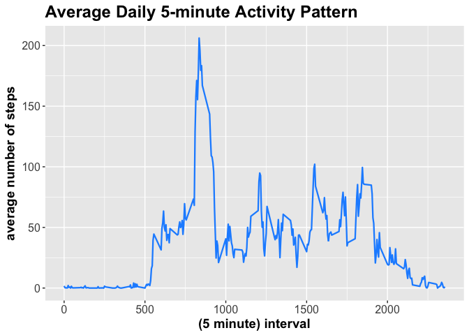
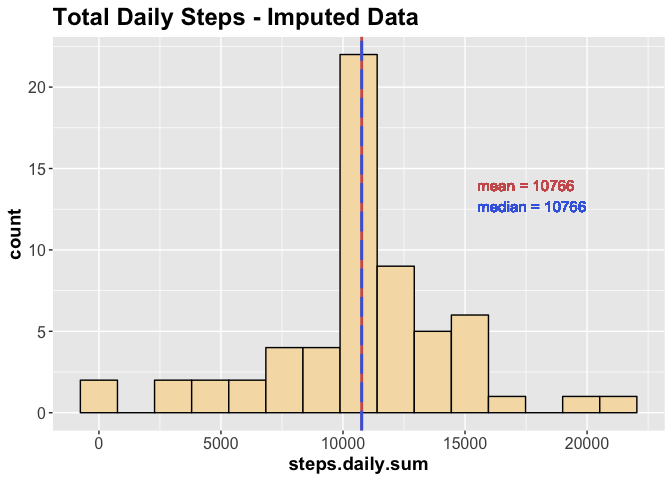

------------------------------------------------------------------------

Introduction
------------

This assignment makes use of data from a personal activity monitoring device. This device collects data at 5 minute intervals throughout the day. The data consists of two months of data from an anonymous individual collected during the months of October and November, 2012 and include the number of steps taken in 5 minute intervals each day (*source: README.md, RepData\_PeerAssessment1*).

------------------------------------------------------------------------

R Libraries
-----------

Both the dplyr and ggplot2 libraries are required for the analysis

``` r
library(dplyr)
library(ggplot2)
```

------------------------------------------------------------------------

Loading and Preprocessing the Data
----------------------------------

Data must be located in the folder "data" under the working directory. The data variables assigned to "NA" will be converted to NA (logical constant).

``` r
if(!exists("activity_data")){
    activity_data <-read.csv(paste0(getwd(),"/data/activity.csv"), 
                             na.strings = "NA",
                             stringsAsFactors = FALSE)
    print("activity data loaded into workspace")
}
```

``` r
head(activity_data)
```

<table class="table table-striped" style="width: auto !important; ">
<thead>
<tr>
<th style="text-align:right;">
steps
</th>
<th style="text-align:left;">
date
</th>
<th style="text-align:right;">
interval
</th>
</tr>
</thead>
<tbody>
<tr>
<td style="text-align:right;">
NA
</td>
<td style="text-align:left;">
2012-10-01
</td>
<td style="text-align:right;">
0
</td>
</tr>
<tr>
<td style="text-align:right;">
NA
</td>
<td style="text-align:left;">
2012-10-01
</td>
<td style="text-align:right;">
5
</td>
</tr>
<tr>
<td style="text-align:right;">
NA
</td>
<td style="text-align:left;">
2012-10-01
</td>
<td style="text-align:right;">
10
</td>
</tr>
<tr>
<td style="text-align:right;">
NA
</td>
<td style="text-align:left;">
2012-10-01
</td>
<td style="text-align:right;">
15
</td>
</tr>
<tr>
<td style="text-align:right;">
NA
</td>
<td style="text-align:left;">
2012-10-01
</td>
<td style="text-align:right;">
20
</td>
</tr>
<tr>
<td style="text-align:right;">
NA
</td>
<td style="text-align:left;">
2012-10-01
</td>
<td style="text-align:right;">
25
</td>
</tr>
</tbody>
</table>
For the 2 month data set (October and November 2012) this will give a total of \[1\] 17568 observations:

``` r
dim(activity_data)
```

\[1\] 17568 3

The number of observations corresponds to the fact that each observation is a 5 minute interval over 61 days:

> 61 days \* 24 hours/day \* 60 minutes/hour \* 0.2 interval/minute

------------------------------------------------------------------------

The *date* variable is imported as **character** class and will need to be converted to **Date** class. The *step* variable is converted to integer class when loaded (with `read.csv()`) because all observations with "NA" were converted (using `na.strings = "NA"` ) to the logical constant NA.

``` r
lapply(activity_data, class)
```

$steps \[1\] "integer"

$date \[1\] "character"

$interval \[1\] "integer"

Converting the *date* variable from Character to Date class:

``` r
activity_data$date <- as.Date(activity_data$date, "%Y-%m-%d" )
```

``` r
lapply(activity_data, class)
```

$steps \[1\] "integer"

$date \[1\] "Date"

$interval \[1\] "integer"

------------------------------------------------------------------------

Mean Total Number of Steps Taken Per Day
----------------------------------------

The total number of steps taken per day are calculated. To do this, the data frame *activity\_data* is grouped by the variable *date* and summed. A new data base, *activity\_day*, is created with two variables - *date* and the total number of steps taken per day, *steps.daily.sum*.

``` r
activity_day <- activity_data %>%
    group_by(date) %>%
    summarise(steps.daily.sum = sum(steps, na.rm = TRUE))
```

``` r
head(activity_day)
```

<table class="table table-striped" style="width: auto !important; ">
<thead>
<tr>
<th style="text-align:left;">
date
</th>
<th style="text-align:right;">
steps.daily.sum
</th>
</tr>
</thead>
<tbody>
<tr>
<td style="text-align:left;">
2012-10-01
</td>
<td style="text-align:right;">
0
</td>
</tr>
<tr>
<td style="text-align:left;">
2012-10-02
</td>
<td style="text-align:right;">
126
</td>
</tr>
<tr>
<td style="text-align:left;">
2012-10-03
</td>
<td style="text-align:right;">
11352
</td>
</tr>
<tr>
<td style="text-align:left;">
2012-10-04
</td>
<td style="text-align:right;">
12116
</td>
</tr>
<tr>
<td style="text-align:left;">
2012-10-05
</td>
<td style="text-align:right;">
13294
</td>
</tr>
<tr>
<td style="text-align:left;">
2012-10-06
</td>
<td style="text-align:right;">
15420
</td>
</tr>
</tbody>
</table>
For the 2 month data set (October and November 2012) this will give a total of \[1\] 61 observations:

``` r
dim(activity_day)
```

\[1\] 61 2

------------------------------------------------------------------------

The mean and median of the total number of steps per day are calculated and used in the histogram plot:

``` r
mean.daily.steps <- mean(activity_day$steps.daily.sum, na.rm = TRUE)
median.daily.steps <- median(activity_day$steps.daily.sum, na.rm = TRUE)
```

<table class="table table-striped" style="width: auto !important; ">
<thead>
<tr>
<th style="text-align:right;">
mean
</th>
<th style="text-align:right;">
median
</th>
</tr>
</thead>
<tbody>
<tr>
<td style="text-align:right;">
9354.23
</td>
<td style="text-align:right;">
10395
</td>
</tr>
</tbody>
</table>

------------------------------------------------------------------------

The histogram of the total number of steps taken per day is constructed with a binwidth calculated using the Freedman-Diaconis's Rule.

``` r
bw <- signif((2 * IQR(activity_day$steps.daily.sum) / 
             length(activity_day$steps.daily.sum)^(1/3)), 3)
```

This results in a (rounded) binwidth of: \[1\] 3070

The histogram includes 2 vertical lines representing the mean and median of steps taken per day.

``` r
g1 <- ggplot(activity_day, aes(steps.daily.sum)) + 
    geom_histogram(color = "black", fill = "powderblue", binwidth = bw) +
    geom_vline(aes(xintercept = mean(steps.daily.sum)), 
               col = "indianred", linetype = "solid", size = 1) +
    geom_vline(aes(xintercept = median(steps.daily.sum)), 
               col = "royalblue", linetype = "longdash", size = 1) +
    geom_text(aes(label=paste("mean =", round(mean.daily.steps, 0)), 
                  y = 15, x = 15500),
              vjust = 2, hjust = 0, col = "indianred", size = 4) +
    geom_text(aes(label=paste("median =", round(median.daily.steps, 0)),
                  y = 15, x = 15500),
              vjust = 4, hjust = 0, col = "royalblue", size = 4) +
    labs(title = "Total Daily Steps") +
    theme(plot.title = element_text(size = 18, face = "bold"),
          axis.text = element_text(size = 12),
          axis.title = element_text(size = 14,face = "bold")) 
```


------------------------------------------------------------------------

Average Daily Activity Pattern
------------------------------

The average number of steps taken per 5 minute interval averaged across all days is calculated. To do this, the data frame *activity\_data* is grouped by the variable *interval* after which the mean of the grouped data is calculated. A new data base, *activity\_interval*, is created with two variables; *interval* and the average number per 5minute interval for all days of the data set, *steps.interval.avg*.

``` r
activity_interval <- activity_data %>%
    group_by(interval) %>%
    summarise(steps.interval.avg = mean(steps, na.rm = TRUE))
```

``` r
head(activity_interval)
```

<table class="table table-striped" style="width: auto !important; ">
<thead>
<tr>
<th style="text-align:right;">
interval
</th>
<th style="text-align:right;">
steps.interval.avg
</th>
</tr>
</thead>
<tbody>
<tr>
<td style="text-align:right;">
0
</td>
<td style="text-align:right;">
1.7169811
</td>
</tr>
<tr>
<td style="text-align:right;">
5
</td>
<td style="text-align:right;">
0.3396226
</td>
</tr>
<tr>
<td style="text-align:right;">
10
</td>
<td style="text-align:right;">
0.1320755
</td>
</tr>
<tr>
<td style="text-align:right;">
15
</td>
<td style="text-align:right;">
0.1509434
</td>
</tr>
<tr>
<td style="text-align:right;">
20
</td>
<td style="text-align:right;">
0.0754717
</td>
</tr>
<tr>
<td style="text-align:right;">
25
</td>
<td style="text-align:right;">
2.0943396
</td>
</tr>
</tbody>
</table>
For the 2 month data set (October and November 2012) this will give a total of \[1\] 288 observations:

``` r
dim(activity_interval)
```

\[1\] 288 2

The number of observations corresponds to the fact that each of the given 5 minute interval observations are averaged over 61 days (17568/61).

------------------------------------------------------------------------

The time series plot of the 5-minute interval and average number of steps taken, averaged across all days is constructed using the *activity\_interval* dataframe.

``` r
g2 <- ggplot(activity_interval, aes(x = interval, y = steps.interval.avg)) + 
    geom_line(linetype = "solid", color = "dodgerblue", size = 0.8) +
    ggtitle("Average Daily 5-minute Activity Pattern") +
    labs(x = "(5 minute) interval", y = "average number of steps") +
    theme(plot.title = element_text(size = 18, face = "bold"),
          axis.text = element_text(size = 12),
          axis.title = element_text(size = 14,face = "bold")) 
```



------------------------------------------------------------------------

Identify maximum daily average number of steps and interval at which this occurs:

``` r
activity_interval_max <- activity_interval[
    which(activity_interval$steps.interval.avg == 
              max(activity_interval$steps.interval.avg)),]
```

<table class="table table-striped" style="width: auto !important; ">
<thead>
<tr>
<th style="text-align:right;">
interval
</th>
<th style="text-align:right;">
steps.interval.avg
</th>
</tr>
</thead>
<tbody>
<tr>
<td style="text-align:right;">
835
</td>
<td style="text-align:right;">
206.1698
</td>
</tr>
</tbody>
</table>

------------------------------------------------------------------------

Imputing Missing Values
-----------------------

Count total number of missing data (NA). Here we expect to only see NA values for the *steps* variable.

``` r
rows_NA <- colSums(is.na(activity_data))
```

<table class="table table-striped" style="width: auto !important; ">
<tbody>
<tr>
<td style="text-align:left;">
steps
</td>
<td style="text-align:right;">
2304
</td>
</tr>
<tr>
<td style="text-align:left;">
date
</td>
<td style="text-align:right;">
0
</td>
</tr>
<tr>
<td style="text-align:left;">
interval
</td>
<td style="text-align:right;">
0
</td>
</tr>
</tbody>
</table>
The observations in *activity\_data* are imputed using the 5 minute interval average from the *activity\_interval* dataframe. This is done by first merging the *activity\_data* and *activity\_interval* dataframes and then mutating all *steps* variable observations with NA to the corresponding average, *steps.interval.avg*.

``` r
activity_data_im <- activity_data %>%
    merge(activity_interval, by = "interval") %>%
    mutate(steps = ifelse(is.na(steps), steps.interval.avg, steps)) %>%
    arrange(date)
```

After imputing, there are no more occurances of NA in the new imputed dataframe, *activity\_data\_im*.

``` r
rows_NA_im <- colSums(is.na(activity_data_im))
```

<table class="table table-striped" style="width: auto !important; ">
<tbody>
<tr>
<td style="text-align:left;">
interval
</td>
<td style="text-align:right;">
0
</td>
</tr>
<tr>
<td style="text-align:left;">
steps
</td>
<td style="text-align:right;">
0
</td>
</tr>
<tr>
<td style="text-align:left;">
date
</td>
<td style="text-align:right;">
0
</td>
</tr>
<tr>
<td style="text-align:left;">
steps.interval.avg
</td>
<td style="text-align:right;">
0
</td>
</tr>
</tbody>
</table>

------------------------------------------------------------------------

The total number of steps taken per day are calculated again with the imputed data. To do this, the imputed dataframe *activity\_data\_im* is grouped by the variable *date* and summed. A new dataframe, *activity\_day\_im*, is created with two variables; *date* and the total number of steps taken per day, *steps.daily.sum*.

``` r
activity_day_im <- activity_data_im %>%
    group_by(date) %>%
    summarise(steps.daily.sum = sum(steps, na.rm = TRUE))
str(activity_day_im)
```

``` r
head(activity_day_im)
```

<table class="table table-striped" style="width: auto !important; ">
<thead>
<tr>
<th style="text-align:left;">
date
</th>
<th style="text-align:right;">
steps.daily.sum
</th>
</tr>
</thead>
<tbody>
<tr>
<td style="text-align:left;">
2012-10-01
</td>
<td style="text-align:right;">
10766.19
</td>
</tr>
<tr>
<td style="text-align:left;">
2012-10-02
</td>
<td style="text-align:right;">
126.00
</td>
</tr>
<tr>
<td style="text-align:left;">
2012-10-03
</td>
<td style="text-align:right;">
11352.00
</td>
</tr>
<tr>
<td style="text-align:left;">
2012-10-04
</td>
<td style="text-align:right;">
12116.00
</td>
</tr>
<tr>
<td style="text-align:left;">
2012-10-05
</td>
<td style="text-align:right;">
13294.00
</td>
</tr>
<tr>
<td style="text-align:left;">
2012-10-06
</td>
<td style="text-align:right;">
15420.00
</td>
</tr>
</tbody>
</table>
As with the non-imputed dataframe, *activity\_day*, a total of \[1\] 61 observations is expected for the imputed dataframe, *activity\_day-im*.

``` r
dim(activity_day_im)
```

\[1\] 61 2

------------------------------------------------------------------------

The mean and median of the total number of steps per day are calculated and used in the histogram plot:

``` r
mean.daily.steps.im <- mean(activity_day_im$steps.daily.sum, na.rm = TRUE)
median.daily.steps.im <- median(activity_day_im$steps.daily.sum, na.rm = TRUE)
```

<table class="table table-striped" style="width: auto !important; ">
<thead>
<tr>
<th style="text-align:right;">
mean
</th>
<th style="text-align:right;">
median
</th>
</tr>
</thead>
<tbody>
<tr>
<td style="text-align:right;">
10766.19
</td>
<td style="text-align:right;">
10766.19
</td>
</tr>
</tbody>
</table>

------------------------------------------------------------------------

The histogram of the total number of steps taken per day is again constructed with a binwidth calculated using the Freedman-Diaconis's Rule.

``` r
bw_im <- signif((2 * IQR(activity_day_im$steps.daily.sum) / 
             length(activity_day_im$steps.daily.sum)^(1/3)), 3)
```

This results in a (rounded) binwidth of: \[1\] 1520

The histogram includes 2 vertical lines representing the mean and median of steps taken per day. In the case of the imputed data, the mean and median are the same and the histogram shows a distribution closer to the normal.

``` r
g3 <- ggplot(activity_day_im, aes(steps.daily.sum)) + 
    geom_histogram(color = "black", fill = "wheat", binwidth = bw_im) +
    geom_vline(aes(xintercept = mean(steps.daily.sum)), 
               col = "indianred", linetype = "solid", size = 1) +
    geom_vline(aes(xintercept = median(steps.daily.sum)), 
               col = "royalblue", linetype = "longdash", size = 1) +
    geom_text(aes(label=paste("mean =", round(mean.daily.steps.im, 0)), 
                  y = 15, x = 15500),
              vjust = 2, hjust = 0, col = "indianred", size = 4) +
    geom_text(aes(label=paste("median =", round(median.daily.steps.im, 0)),
                  y = 15, x = 15500),
              vjust = 4, hjust = 0, col = "royalblue", size = 4) +
    labs(title = "Total Daily Steps - Imputed Data") +
    theme(plot.title = element_text(size = 18, face = "bold"),
          axis.text = element_text(size = 12),
          axis.title = element_text(size = 14, face = "bold")) 
```



------------------------------------------------------------------------

Further examination of the total number of steps taken per day, *steps.daily.sum*, for the imputed and non-imputed data using the `summary()` function shows a difference in both the mean, median and minimum number of average steps per day:

``` r
summary(activity_day[2])
summary(activity_day_im[2])
```

<table class="table table-striped" style="width: auto !important; ">
<thead>
<tr>
<th style="text-align:left;">
</th>
<th style="text-align:left;">
non-imputed data
</th>
<th style="text-align:left;">
imputed data
</th>
</tr>
</thead>
<tbody>
<tr>
<td style="text-align:left;">
</td>
<td style="text-align:left;">
Min. : 0
</td>
<td style="text-align:left;">
Min. : 41
</td>
</tr>
<tr>
<td style="text-align:left;">
</td>
<td style="text-align:left;">
1st Qu.: 6778
</td>
<td style="text-align:left;">
1st Qu.: 9819
</td>
</tr>
<tr>
<td style="text-align:left;">
</td>
<td style="text-align:left;">
Median :10395
</td>
<td style="text-align:left;">
Median :10766
</td>
</tr>
<tr>
<td style="text-align:left;">
</td>
<td style="text-align:left;">
Mean : 9354
</td>
<td style="text-align:left;">
Mean :10766
</td>
</tr>
<tr>
<td style="text-align:left;">
</td>
<td style="text-align:left;">
3rd Qu.:12811
</td>
<td style="text-align:left;">
3rd Qu.:12811
</td>
</tr>
<tr>
<td style="text-align:left;">
</td>
<td style="text-align:left;">
Max. :21194
</td>
<td style="text-align:left;">
Max. :21194
</td>
</tr>
</tbody>
</table>

------------------------------------------------------------------------

Differencies in Activity Patterns between Weekdays and Weekends
---------------------------------------------------------------

The average number of steps taken per 5 minute interval averaged across all days is calculated for weekdays and weekends using the imputed data. To do this, the imputed dataframe, *activity\_data\_im*, is first mutated to include a new variable, *week.day*, that identifies the days of the month that fall on either a weekend or a weekday. The dataframe is then grouped by the new varaible, *week.day*, and the variable *interval*. A new dataframe is calculated with the two variables; *interval* and the average number per 5minute interval for all days of the data set, *steps.interval.avg*.

``` r
activity_interval_im <- activity_data_im %>%
    mutate(week.day = 
               ifelse(weekdays(date) %in% 
                          c("Saturday", "Sunday"), "Weekends", "Weekdays")) %>%
    group_by(week.day, interval) %>%
    summarise(steps.interval.avg = mean(steps, na.rm = TRUE))
str(activity_interval_im)
```

``` r
head(activity_interval_im)
```

<table class="table table-striped" style="width: auto !important; ">
<thead>
<tr>
<th style="text-align:left;">
week.day
</th>
<th style="text-align:right;">
interval
</th>
<th style="text-align:right;">
steps.interval.avg
</th>
</tr>
</thead>
<tbody>
<tr>
<td style="text-align:left;">
Weekdays
</td>
<td style="text-align:right;">
0
</td>
<td style="text-align:right;">
2.2511530
</td>
</tr>
<tr>
<td style="text-align:left;">
Weekdays
</td>
<td style="text-align:right;">
5
</td>
<td style="text-align:right;">
0.4452830
</td>
</tr>
<tr>
<td style="text-align:left;">
Weekdays
</td>
<td style="text-align:right;">
10
</td>
<td style="text-align:right;">
0.1731656
</td>
</tr>
<tr>
<td style="text-align:left;">
Weekdays
</td>
<td style="text-align:right;">
15
</td>
<td style="text-align:right;">
0.1979036
</td>
</tr>
<tr>
<td style="text-align:left;">
Weekdays
</td>
<td style="text-align:right;">
20
</td>
<td style="text-align:right;">
0.0989518
</td>
</tr>
<tr>
<td style="text-align:left;">
Weekdays
</td>
<td style="text-align:right;">
25
</td>
<td style="text-align:right;">
1.5903564
</td>
</tr>
</tbody>
</table>
For the 2 month data set (October and November 2012) this will give a total of \[1\] 576 observations:

``` r
dim(activity_interval_im)
```

\[1\] 576 3

The number of observations corresponds to the fact that each of the given 5 minute interval observations are averaged over 61 days (17568/61), and are then grouped into 2 sets, one for weekends and another for weekdays.

------------------------------------------------------------------------

The time series plot of the 5-minute interval and average number of steps taken, averaged across all days is constructed using the *activity\_interval\_im* dataframe.

``` r
g4 <- ggplot(activity_interval_im, aes(x = interval, y = steps.interval.avg)) + 
    facet_grid(week.day~ .) + 
    geom_line(linetype = "solid", color = "darkgreen", size=0.8) +
    ggtitle("Average 5-minute Activity Pattern") +
    labs(x = "(5 minute) interval", y = "average number of steps") +
    theme(plot.title = element_text(size = 18, face = "bold"),
          strip.text.y = element_text(size = 14, face = "bold"),
          axis.text = element_text(size = 12),
          axis.title = element_text(size = 14, face = "bold")) 
```


The plot show a peak for the weekdays similar to the previous average actvity pattern from all days combined. The weekends indicate more activity than the weekdays.

------------------------------------------------------------------------
